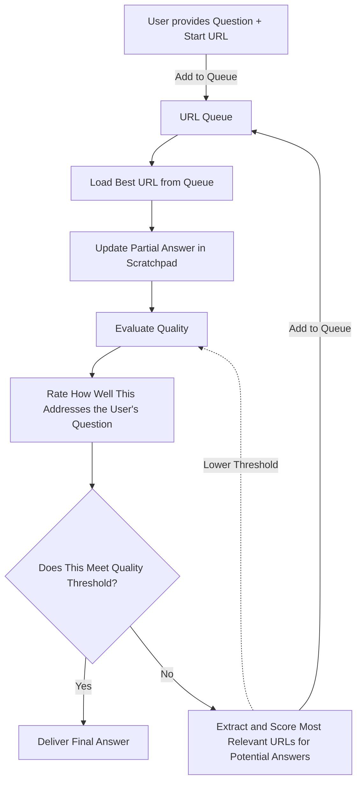

# Ask Website - Deep Search Agent

An experimental AI agent that implements a deep search concept for web exploration, predating the release of commercial deep search features. This project demonstrates an intelligent web crawling system that uses AI to iteratively search through websites, maintaining a scratchpad of findings, ranking URLs by relevance, and progressively refining its understanding to zero in on the most accurate answers.

## 🔍 Deep Search Concept

This agent implements a novel approach to web search that goes beyond simple crawling. It:

- **Self-Calling Architecture**: The agent recursively calls itself to explore new pages
- **Dynamic Scratchpad**: Maintains and updates a running knowledge base of partial answers
- **Intelligent URL Ranking**: Continuously re-ranks discovered URLs based on relevance scores
- **Progressive Refinement**: Each iteration improves the answer quality by building on previous findings
- **Adaptive Thresholds**: Uses dynamic confidence thresholds that increase over time to prevent infinite loops

## 🏗️ Architecture



## 🔄 Deep Search Flow

The agent follows this iterative process:

1. **Initialization**: Parse user question and target website
2. **URL Prioritization**: Start with the provided URL and domain (highest priority)
3. **Content Extraction**: Scrape and analyze the highest-priority URL
4. **AI Analysis**: Use structured AI output to:
   - Extract partial answers
   - Score confidence in current findings
   - Identify promising new URLs
   - Rank new leads by relevance
5. **State Updates**: 
   - Add current URL to "done" list with partial answer
   - Update URL queue with new leads, sorted by score
   - Increment confidence threshold
6. **Decision Point**: Continue searching if confidence score > threshold
7. **Iteration**: Repeat from step 3 with next highest-priority URL
8. **Convergence**: Generate final answer when confidence threshold is met

## 📊 Intelligent Ranking System

The system uses a sophisticated scoring mechanism:

- **Initial URLs**: Domain (101 points), Target URL (102 points)
- **Lead Discovery**: AI assigns 0-100 relevance scores to discovered URLs
- **Dynamic Thresholds**: Starting at 10, incrementing by 5 each iteration
- **Queue Management**: URLs sorted by score, highest priority processed last
- **Confidence Scoring**: Each page gets a "continue searching" score (0-100)

## 🧠 AI-Powered Components

### Question Analysis
Uses structured AI output to parse user queries into:
- Clean question text
- Target URL for exploration

### Content Analysis
For each page, the AI provides:
- **Generic Context**: 50-word description of the website
- **Answer Candidate**: Complete or partial answer found
- **Continue Searching Score**: Confidence that more exploration is needed (0-100)
- **Leads**: List of promising URLs with relevance scores
- **Final Answer**: Only when confidence threshold is met

## 🛠️ Technical Stack

- **Framework**: LangGraph for state management and workflow orchestration
- **Web Scraping**: Firecrawl API for content extraction
- **Caching**: SQLite-based caching for both LLM calls and web scraping
- **Data Validation**: Pydantic schemas for structured AI outputs

## 📝 Usage Examples

```python
# Example 1: Product availability inquiry
HumanMessage(content="Does https://www.skybad.de sell Pipe Insulation ?")

# Example 2: Contact information search  
HumanMessage(content="Can you search me a phonenumber to contact someone at: https://www.easykit.be/")

# Example 3: Price comparison
HumanMessage(content="Can u find the best price for 'Samsung Galaxy S24, 256GB' on https://tweakers.net/pricewatch/ ?")

# Example 4: Technical specifications
HumanMessage(content="What llm models offered by Groq have a context window larger then 100k tokens on https://groq.com ?")
```

## 🔧 Setup

1. **Install Dependencies**:
   ```bash
   pip install -r requirements.txt
   ```

2. **Environment Variables**:
   ```bash
   FIRECRAWL_API_KEY=your_firecrawl_api_key
   # Plus your preferred LLM provider API keys
   ```

3. **Run the Agent**:
   ```bash
   python main.py
   ```

## 🧪 Experimental Features

This project explores several cutting-edge concepts:

- **Recursive Self-Improvement**: Agent learns from each page to make better decisions
- **Dynamic Exploration Strategy**: Adapts search behavior based on findings
- **Multi-Modal Analysis**: Combines content analysis with link discovery
- **Confidence-Based Termination**: Stops when sufficient confidence is reached
- **Memory-Efficient State Management**: Maintains context without exponential growth

## 🎯 Key Innovations

1. **Scratchpad Architecture**: Persistent state tracking across iterations
2. **Adaptive Threshold System**: Prevents infinite loops while ensuring thoroughness  
3. **URL Relevance Ranking**: AI-powered prioritization of exploration paths
4. **Progressive Answer Refinement**: Each iteration builds on previous findings
5. **Context-Aware Analysis**: Uses full exploration history for better decisions


---

*This implementation demonstrates an early approach to deep search AI agents, showcasing how recursive self-improvement and intelligent exploration can lead to more accurate and comprehensive web-based question answering.*
